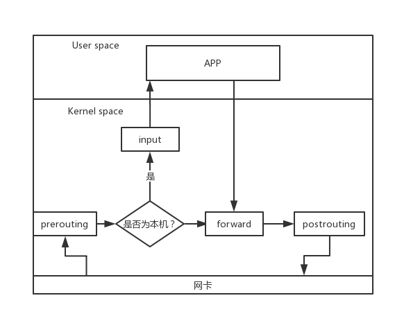
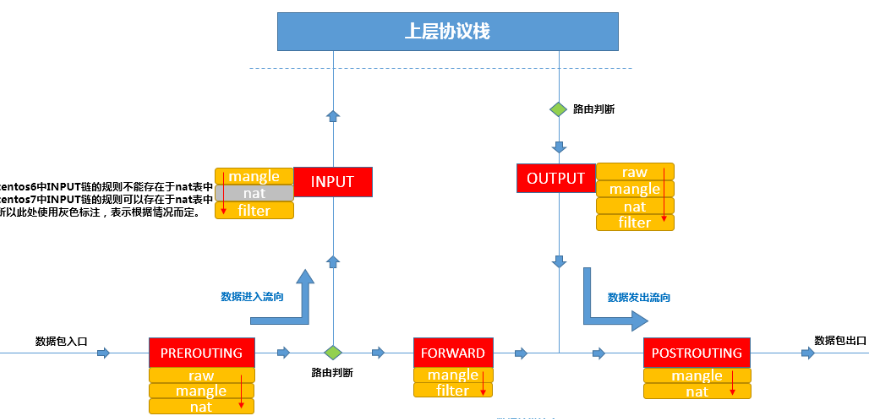
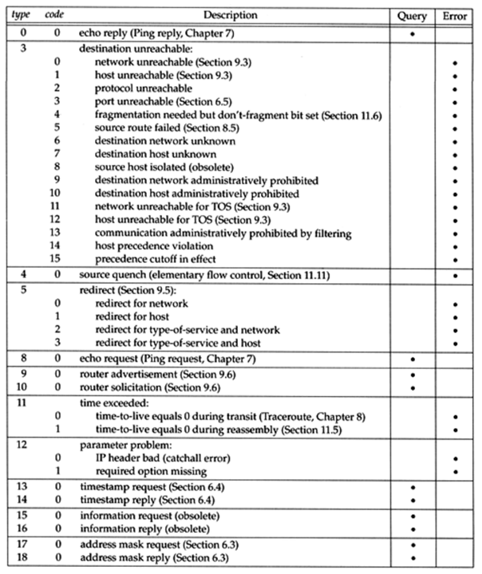

[TOC]

# Linux防火墙学习笔记

> [iptables详解](https://www.zsythink.net/archives/tag/iptables)

## 简介

在Linux 2.4之后，使用的防火墙架构为Netfilter，它是一个通用、抽象的框架，提供了一整套hook函数的管理机制，使得数据包过滤，NAT和基于协议类型的连接跟踪成为可能。

Netfilter实现了如下功能：

* 网络地址转换（NAT）
* 数据包内容修改
* 数据包过滤的防火墙

Netfilter实现了数据包的五个Hook Point，分别是PRE_ROUTING、INPUT、OUTPUT、FORWARD、POST_ROUTING。

Netfilter所设置的规则存放在内核内存中，我们可以使用iptables，firewalld这些应用层程序通过Netfilter提供的接口对内核内存中的Netfilter配置表进行修改。这些表由tables、chains、rules组成。

## iptables的链和表

在收到数据包时，按照预定义的规则：如果数据包头符合一定条件就按照要求处理数据包。规则存储在内核空间的数据包过滤表中，这些规则可以指定源地址，目的地址，传输协议，服务类型等，当与规则匹配时，iptables就按照规则所定义方法处理。

### 规则链

链是数据包的传播路径，每一条链就是众多规则中的一个检查清单，每一条链中可以有数条规则。当数据包到达一个链，iptables就会从链的第一条规则开始检查，是否满足所定义规则，若满足则根据定义的方法处理该数据包，否则继续检查，直到全部不符合，按照该链默认策略处理该数据包。

|    名称     |            描述            |
| :---------: | :------------------------: |
| PREROUTING  | 在进行路由选择前处理数据包 |
|    INPUT    |      处理流入的数据包      |
|   OUTPUT    |      处理流出的数据包      |
|   FORWARD   |      处理转发的数据包      |
| POSTROUTING | 在进行路由选择后处理数据包 |

其作用位置如下图表示：




### 规则表

表提供了特殊的功能，iptables中有4个表，filter，nat，mangle，raw，分别实现

iptables中有如下表：

|  表名  |                             功能                             |                       链                        |
| :----: | :----------------------------------------------------------: | :---------------------------------------------: |
| filter |                 过滤数据包：iptables_filter                  |             INPUT，FORWARD，OUTPUT              |
|  nat   |      网络地址转换(IP、端口)。对应内核模块：iptable_nat       |     PREROUTING，POSTROUTING，INPUT，OUTPUT      |
| mangle | 修改数据包的服务类型、TTL、并且可以配置路由实现QOS。对应内核模块：iptable_mangle | PREROUTING，POSTROUTING，INPUT，OUTPUT，FORWARD |
|  raw   | 决定数据包是否被状态跟踪机制处理。对应内核模块：iptable_raw  |               OUTPUT，PREROUTING                |

规则表的优先顺序：
**raw ---> mangle ---> nat ---> filter**

### 表与链的关系

链相当于在数据包传播路上的检查点，经过该检查点，会依次匹配链上的每一条规则。

表则是对规则的分类，对数据包的不同类型操作划分到不同的表中。

我们可以简单理解为在某一个检查点（链）会有多种检查/修改能力（表）。

那么我们来探索一下每一个链中都可以有哪种表的规则：

| 链（HOOK POINT） | 表（function）           |
| ---------------- | ------------------------ |
| PREROUTING       | raw、mangle、nat         |
| INPUT            | mangle、filter、nat      |
| FORWARD          | mangle、nat、filter      |
| OUTPUT           | raw、mangle、nat、filter |
| POSTROUTING      | mangle、nat              |



## 管理命令

### 规则查询

```shell
iptables -t 表名 -L
# 查看对应表的所有规则

iptables -t 表名 -L 链名
# 查看指定表的指定链中的规则

iptables -t 表名 -v -L
# 查看指定表中所有规则，-verbose，会显示计数器信息

iptables -t 表名 -n -L
# 对规则中IP和接口不解析

iptables --line-numbers -t 表名 -L
# 表示查看表的所有规则，且显示规则的序号

iptables --line -t -filter -nxvL
# 查看filter表的所有链，不解析IP且显示计数器最详细的信息

iptable --line -t filter -nvxL INPUT
# 查询指定表，指定链详细信息

```

### 规则管理

iptables常用的匹配条件：`源地址`、`目标地址`、`源端口`、`目标端口`

常用的动作：`接受(ACCEPT)`、`丢弃(DROP)`、`拒绝(REJECT)`

```shell
iptables -t 表名 -A 链名 匹配条件 -j 动作
iptables -t filter -A INPUT -s 1.1.1.1 -j DROP
# 向指定表，指定链的尾部添加一条规则，-A选项表示在对应链的末尾添加规则

iptables -t 表名 -I 链名 [位置] 匹配条件 -j 动作
iptables -t filter -I INPUT 2 -s 1.1.1.1 -j ACCEPT
# 向指定表，指定链的指定位置加入规则

iptables -t 表名 -P 链名 动作
iptables -t filter -P FORWARD ACCEPT
# 修改指定表的FORWARD链的默认策略设置为ACCEPTE

iptables -t 表名 -D 链名 规则序号
iptables -t filter -D INPUT 3
# 删除filter表,INPUT链的第三行

iptables -t 表名 -D 链名 匹配条件 -j 动作
iptables -t filter -D INPUT -s 1.1.1.1 DROP
# 删除filter表，INPUT链匹配的规则

iptables -t 表名 -F
iptables -t 表名 -F INPUT
# 清空规则

iptables -t 表名 -R 链名 规则序号 规则原本的匹配条件 -j 动作
iptables -t filter -R INPUT 3 -s 1.1.1.1 -j ACCEPT
# 修改指定位置的规则，注意保持原不变条件

iptables -t 表名 -P 链名 动作
iptables -t filter -P FORWARD ACCEPT
# 修改filter表，FORWARD链，默认策略为ACCEPT

规则保存位置/etc/sysconfig/iptables
service iptables save
iptables-save > /etc/sysconfig/iptables
iptables-restore < /etc/sysconfig/iptables
```

### 匹配条件

```shell
iptables -t filter -I INPUT -s 1.1.1.1,1.1.1.2 -j DROP
iptables -t filter -I INPUT -s 1.1.1.0/24 -j ACCEPT
iptables -t filter -I INPUT ! -s 1.1.1.0/24 -j ACCEPT
# -s用于匹配源地址，可以指定对个源地址，网段，取反

iptables -t filter -I OUTPUT -d 1.1.1.1,1.1.1.2 -j DROP
iptables -t filter -I INPUT -d 1.1.1.0/24 -j ACCEPT
iptables -t filter -I INPUT ! -d 1.1.1.0/24 -j ACCEPT
# -d用于匹配报文的目标地址，可以同时指定多个目标地址，网段，取反


iptables -t filter -I INPUT -p tcp -s 1.1.1.1 -j ACCEPT
iptables -t filter -I INPUT !-p udp -s 1.1.1.1 -j ACCEPT
# -p用于匹配报文的协议类型，支持的类型有:tcp、udp、udplite、icmp、esp、ah、sctp、icmpv6、mh

iptables -t filter -I INPUT -p icmp -i eth4 -j DROP
iptables -t filter -I INPUT -p icmp ! -i eth4 -j DROP
# -i用于匹配从那个网卡流入本机，只使用在INPUT，FORWARD、PREROUTING链

iptables -t filter -I OUTPUT -p icmp -o eth4 -j DROP
iptables -t filter -I OUTPUT -p icmp ! -o eth4 -j DROP
# -o参数用于匹配从哪个网卡流出本机，只使用在OUTPUT、FORWARD、POSTROUTING链
```

### 常用拓展模块

```shell
iptables -t filter -I OUTPUT -d 1.1.1.1 -p tcp -m tcp --sport 22 -j REJECT
iptables -t filter -I INPUT -s 192.168.1.146 -p tcp -m tcp --dport 22:25 -j REJECT
iptables -t filter -I INPUT -s 1.1.1.1 -p tcp -m tcp --dport :22 -j REJECT
iiptables -t filter -I INPUT -s 1.1.1.1 -p tcp -m tcp ! --dport 22 -j REJECT
# -p用于制定匹配的协议 -m为匹配的附加模块， --dport、--sport为附加模块tcp的功能，用于匹配端口号

iptables -t filter -I OUTPUT -d 1.1.1.1 -p udp -m multiport --sport 137,138 -j ACCEPT
iptables -t ffiler -I INPUT -d 80:90,8080,8088 -p tcp -j ACCEPT
# -m multiport模块用于制定对个离散的端口，多个端口使用逗号隔开

iptables -t filter -I INPUT -m iprange --src-range 1.1.1.1-1.1.1.15 -j DROP
iptables -t filter -I OUTPUT -m iprange --dst-range 1.1.1.1-1.1.1.15 -j DROP
iptables -t filter -I INPUT -m iptange ! --src-range 1.1.1.1-1.1.1.15 -j DROP
# iprange模块，指定范围连续的IP地址

iptables -t filter -I INPUT -p tcp --sport 80 -m string --algo kmp --string "163" -j REJECT
iptables -t filter -I INPUT -p tcp --sport 80 -m string --algo bm --string "baidu" -j REJECT
# string模块，匹配字符，--algo制定匹配算法bm或kmp，指定需要匹配的字符串


iptables -t filter -I OUTPUT -p tcp --dport 80 -m time --timestart 09:00:00 --timestop 19:00:00 -j REJECT
iptables -t filter -I OUTPUT -p tcp --dport 443 -m time --timestart 09:00:00 --timestop 19:00:00 -j REJECT
iptables -t filter -I OUTPUT -p tcp --dport 80  -m time --weekdays 6,7 -j REJECT
iptables -t filter -I OUTPUT -p tcp --dport 80  -m time --monthdays 22,23 -j REJECT
iptables -t filter -I OUTPUT -p tcp --dport 80  -m time ! --monthdays 22,23 -j REJECT
iptables -t filter -I OUTPUT -p tcp --dport 80  -m time --timestart 09:00:00 --timestop 18:00:00 --weekdays 6,7 -j REJECT
iptables -t filter -I OUTPUT -p tcp --dport 80  -m time --weekdays 5 --monthdays 22,23,24,25,26,27,28 -j REJECT
iptables -t filter -I OUTPUT -p tcp --dport 80  -m time --datestart 2017-12-24 --datestop 2017-12-27 -j REJECT
# time模块，用于匹配时间，--timestart：开始时间不可取反， --timestop:结束时间范围不可取反， --weekdays:星期可取反， --monthdays：日期可取反， --datestart:开始日期不可取反， --datestop：结束日期不可取反

iptables -I INPUT -p tcp --dport 22 -m connlimit --connlimit-above 2 -j REJECT
iptables -I INPUT -p tcp --dport 22 -m connlimit --connlimit-above 20 --connlimit-mask 24 -j REJECT
iptables -I INPUT -p tcp --dport 22 -m connlimit --connlimit-above 10 --connlimit-mask 27 -j REJECT
# 限制链接数，--connlimit-above:限制单个ip链接数量， --connlimit-mask:不可单独使用，配合前一选项限制某一网段

iptables -t filter -I INPUT -p icmp -m limit --limit-burst 3 --limit 10/minute ACCEPT
iptables -t filter -A INPUT -p icmp -j REJECT
# limit模块，--limit-burst:令牌桶，令牌最大数，  --limit：令牌声场频率，支持second，minute，hour，day
```

### tcp拓展模块
tcp模块提供了对tcp标识位的匹配
```shell
iptables -t filter -I OUTPUT -d 1.1.1.1 -p tcp -m tcp --sport 22 -j REJECT
iptables -t filter -I INPUT -s 192.168.1.146 -p tcp -m tcp --dport 22:25 -j REJECT
iptables -t filter -I INPUT -s 1.1.1.1 -p tcp -m tcp --dport :22 -j REJECT
iiptables -t filter -I INPUT -s 1.1.1.1 -p tcp -m tcp ! --dport 22 -j REJECT
# -p用于制定匹配的协议 -m为匹配的附加模块， --dport、--sport为附加模块tcp的功能，用于匹配端口号

iptables -t filter -I INPUT -p tcp -m tcp --dport 22 --tcp-flags SYN,ACK,FIN,RST,URG,PSH SYN -j REJECT

iptables -t filter -I OUTPUT -p tcp -m tcp --sport 22 --tcp-flags SYN,ACK,FIN,RST,URG,PSH -j REJECT

iptables -t filter -I INPUT -p tcp -m tcp --dport 22 --tcp-flag ALL SYN -j REJECT
iptables -t filter -I OUTPUT -p tcp -m tcp --sport 22 --tcp-flags ALL SYN,ACK -j REJECT
# --tcp-flag用于匹配tcp头的标识位，SYN，ACL,FIN,RST,URG,PSH SYN 表示匹配前面所有标识位，且SYN位为1等效于iptables -t filter -I INPUT -p tcp --dport 22 --syn -j REJECT
```

### UDP与ICMP拓展

```shell
iptables -t filter -I INPUT -p udp -m udp --dport 137 -j ACCEPT
iptables -t filter -I INPUT -p udp --sport 137 -j ACCEPT
# 使用--sport、--dport匹配报文的UDP端口号
```

icmp报文类型如下图所示



```shell
iptables -t filter -I INPUT -p icmp -m icmp --icmp-type 8/0 -j REJECT
iptables -t filter -I INPUT -p icmp --icmp-type 8 -j REJECT
iptables -t filter -I OUTPUT -p icmp icmp 0/0 -j REJECT
iptables -t filter -I OUTPUT -p icmp --icmp-type 0 -j REJECT
iptables -t filter -I INPUT -p icmp --icmp-type "echo-request" -j REJECT
```

### state扩展

对于stat模块的连接而言，可以分为5中状态：NEW、ESTABLISHED、RELATED、INVLID、UNTRACKED
NEW:连接中的第一个包
ESTABLISHED:NEW状态之后的包
RELATED:相关的包，比如FTP的命令与数据通道
INVALID:没法被识别的包或者没有任何状态
UNTRACKED:未追踪的包，无法找到相关链接

```shell
iptables -t filter -I INPUT -m state --state RELATED,ESTABLISHED -j ACCEPT
iptables -t filter -A INPUT -j REJECT
# 可以主动向外部连接，而外部无法向内部建立连接
```

### 黑白名单机制

我们可以修改链的默认策略来实现黑白名单机制  
`iptables -t filter -P INPUT DROP`与
`iptables -t filter -P INPUT ACCEPT`

### 自定义链

我们可以将针对一个服务的管理规则放入一个自定义的链中，使用`iptables -t filter -N IN_WEB`可以在filter表创建一个名为IN_WEB的自定义链，在自定义链中添加规则`iptables -t filter -I IN_WEB -s 1.1.1.1 -j REJECT`，在默认链中调用自定义链`iptables -I INPUT -p tcp --dport 80 -j IN_WEB`
重命名自定义链`iptables -E IN_WEB WEB`,删除自定义链需要先清除引用`iptables -D INPUT -p tcp --dport 80 -j WEB`然后清除自定义链规则`iptables -F WEB`最后删除自定义链`iptables -X WEB`


### 网络防火墙

主机防火墙：针对单台主机进行防护
网络防火墙：位于网络入口或边缘，对网络入口进行防护，服务于本地局域网

由图可知，当作为主机防火墙过滤报文时，用到了INPUT，OUTPUT，而FORWARD也拥有过滤功能，该链为网络防火墙的主要职责。

```shell
# 开启ipv4转发
echo 1 > /proc/sys/net/ipv4/ip_forward
sysctl -w net.ipv4.ip_forward=1
# 配置文件
/etc/sysctl.conf
# centos7
/usr/lib/sysctl.d/00-system.conf
```

拒绝所有转发 `iptables -A FORWARD -j REJECT`
加入规则，接受源地址为1.1.0.0/16网段，目的端口为80的报文 `iptables -I FORWARD -s 1.1.0.0/16 -p tcp --dport 80 -j ACCEPT`
，加入状态放行规则`iptables -I FORWARD -m state --state ESTABLISHED，RELATED -j ACCEPT`

### 动作

动作也有基础与拓展的区别
如ACCEPT、DROP为基础动作
REJECT为拓展动作

#### REJECT动作

可以使用`--reject-with`选项，设置当拒绝时的提示信息：

```shell
icmp-net-unreachable
icmp-host-unreachable
icmp-port-unreachable
icmp-proto-unreachable
icmp-net-prohibited
icmp-host-pro-hibited
icmp-admin-prohibited
```

默认为`icmp-port-unreachable`
示例：`iptables -t filter -I INPUT -p tcp --dport 22 -j REJECT --reject-with icmp-net-unreachable`

#### LOG动作

LOG动作只记录匹配到的报文不做任何其他处理
默认记录位置为`/var/log/message`,也可以指定其他位置:

```shell
# 修改日志配置文件
vim /etc/rsyslog.conf
# 或者/etc/syslog.conf
# 加入如下配置
kern.warning /var/log/iptables.log
# 重启服务
service rsyslog restart
# 或者syslogd
```

LOG也有自己的选项：

```shell
# 指定日志级别：emerg、alert、crit、error、warning、notice、info、debug
--log-level debug

# 添加标签信息，方便过滤
--log-prefix
```

示例：`iptables -I INPUT -p tcp --dport 22 -m state --state NEW -j LOG --log-prefix "want-in-from-port-22"`

#### NAT

NAT(Network Address Translation)网络地址转换，就是修改报文的IP地址,NAT功能通常被集成到路由器,防火墙中。

使用场场景1 SNAT：
如内部网络有10台主机，当内部网络中的主机与其他网络中的主机通讯时，会暴露自己的IP地址，我们可以使用如下方法隐藏主机IP：
当内部网络主机向外部发送报文时，报文会经过防火墙或路由器，当经过时，可以将报文的源IP地址修改为防火墙或路由器的IP，当其他网络的主机收到报文时，源地址为路由器的IP。这样就隐藏了内部网络的主机IP。
路由器会维护一张NAT表，表中记录了报文来自哪个内部主机的哪个进程（IP+PORT），当报文经过路由器时，会将内部主机的源IP替换成路由器的IP地址，将源端口也映射为某个端口，NAT表会记录这个对应关系。

外部主机收到报文，源IP与端口显示的时路由器的，回应时，路由器根据NAT记录表将相应报文的dst ip，dst port修改为内部主机的IP与PORT。这样在整个通信过程中，隐藏了内部主机的IP。

上述过程准确来说时NAPT功能，NAPT时NAT的一种，Network Address Port Translation。
上述整个过程分为两个部分，1向外发出，2接受回应。发出过程源IP会被修改也就是Source Network Address Translation，SNAT。
接受回应过程目的IP会被修改也即是Destinationnetwork address translation缩写为DNAT。

但是，上述整个过程被称为SNAT，因为先发生了SNAT。如果先发生DNAT则整个过程可以称为DNAT。

场景2 DNAT：
如公司有自己的局域网，网络中有两台服务器，一个WEB，一个数据库，但是在局域网用的是私有IP，只能被局域网内主机访问。整个公司有一个可用的公网IP。那么我们可以将公网IP配置到某台主机或路由器，然后宣称这个IP提供服务。在收到请求时将目的IP+80端口转换为私有IP+端口。回应时再将私有IP+端口映射成公网IP+80端口。

##### SNAT
将来自10.1.0.0、/16网段的报文源地址修改成公司的公网IP
`iptables -t nat -A POSTROUTING -s 10.1.0.0/16 -j SNAT --to-source -192.168.1.149`
`-t nat` 标识操作NAT表。
`-A PORTROUTING` 表示将SNAT的规则添加到POSTROUTING链的末尾，在CentOS7中SNAT规则只存在于POSTROUTING链与INPUT，在CentOS6只存在与POSTROUTING链。POSTROUTING为发出报文的最后一个关卡，必须在发出之前修改报文。
`-s 10.1.0.0/16` 表示来自10.1.0.0/16网段
`-j SNAT` 表示使用SNAT动作，对匹配到的报文进行源地址转换。
`--to-source 192.168.1.146` 表示将匹配到的报文源IP修改为192.168.1.146

手动配置SNAT之后，不需要手动进行DNAT，iptables会自动维护NAT表，将响应报文的目标地址转换回来。

##### DNAT

公司只有一个公网IP，但是却有很多服务器提供不同服务，想要通过公网访问服务，可以使用DNAT：
`iptables -t nat -I PREROUTING -d 192.168.1.146 -p tcp -m tcp --dport 3389 -j DNAT --to-destination 10.1.0.6:3389` 配置命令参数如下：

`-t nat -I PREROUTING`:在nat表中的PREROUTING链配置DNAT规则，DNAT只能配置在PREROUTING链与OUTPUT链中。

`-d 192.168.1.146 -p tcp --dport 3389`:表示报文目标地址为公司公网IP地址，目标端口为TCP的3389号端口（windows远程桌面）。
`-j DNAT --to-destination 10.1.0.6:3389`:表示将符合的报文进行DNAT，目的IP，PORT修改为10.1.0.6:3389。

DNAT配置完成后可能需要额外配置SNAT

#### MASQUERADE

当我们拨号上网时，每次分配的IP都往往不同，所以需要重新配置SNAT规则，通过MASQUERADE可以动态的将源地址转换为可用的IP地址，与SNAT实现的功能完全一致，只是不需要指定明确的IP。
例如：`iptables -t nat -I POSTROUTING -s 10.1.0.0/16 -o eth1 -j MASQUERADE`
通过指定网卡出去的报文，经过POSTROUTING链时，会自动将报文源地址修改为外网网卡上可用的IP地址。可以将其理解为动态，自动化的SNAT。

#### REDIRECT

可以使用REDIRECT动作在本机进行端口映射。
比如将本地的80端口映射为到本机的8080端口
`iptables -t nat -A PREROUTING -p tcp --dport 80 -j REDIRECT --to-ports 8080`
REDIRECT只作用于PREROUTING链与OUTPUT链中。